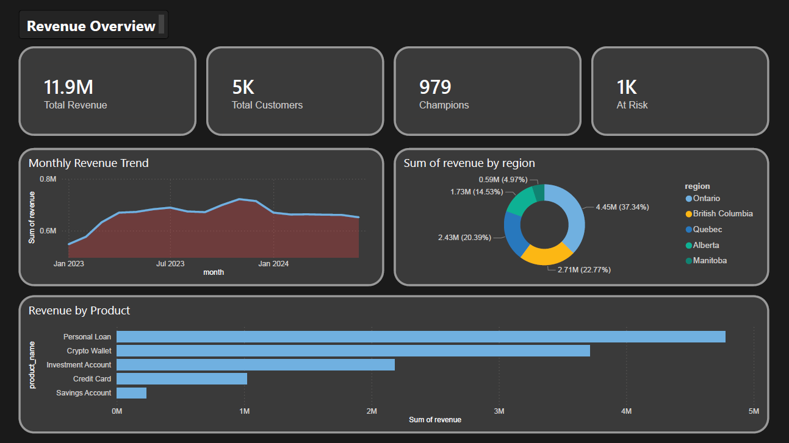
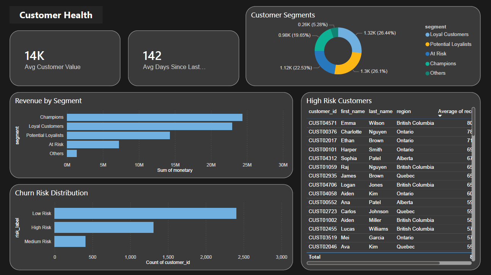
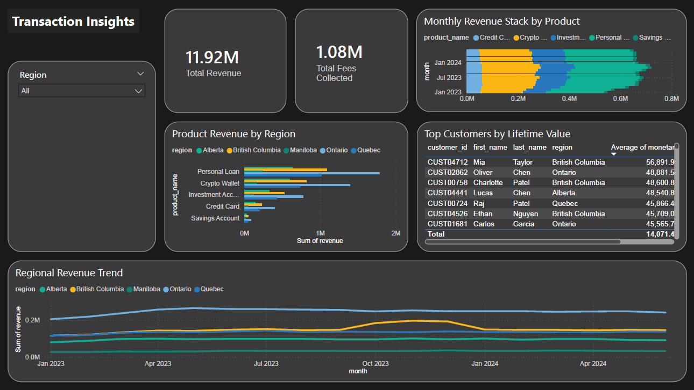

# FinTrack Analytics
### Customer Spending & Revenue Intelligence — End-to-End Data Analyst Portfolio Project

<br/>


---

## Overview

FinTrack Analytics simulates a real data analyst engagement at a Canadian fintech company. The project covers the full analyst workflow — from raw data ingestion and SQL analysis to Python-based customer segmentation and an executive Power BI dashboard.

> **Fictional company:** FinTrack offers savings accounts, investment accounts, credit cards, personal loans, and crypto wallets to 5,000 customers across Canada.

**The analyst brief:** Understand 18 months of revenue performance, identify the most valuable customer segments, flag churn risk, and deliver actionable findings to leadership.

---

## Dashboard Preview

### Page 1 — Revenue Overview


### Page 2 — Customer Health


### Page 3 — Transaction Insights


---

## Key Findings

| # | Finding | Detail |
|---|---|---|
| 1 | **Churn Spike** | 18% of customers churned in Apr–May 2023 vs. 12% baseline — correlated with low credit scores (avg 612) |
| 2 | **BC Outperformance** | British Columbia generated 30% more revenue per customer in Q4 2023 |
| 3 | **Declining Product** | Credit Card revenue declined ~15% over 18 months while Investment Accounts grew 38% |
| 4 | **Revenue Concentration** | Champions segment (12% of customers) drives 35% of total revenue |
| 5 | **Cross-sell Gap** | ~40% of active customers hold only 1 product — strongest upsell opportunity |

---

## Tech Stack

| Layer | Tool | Purpose |
|---|---|---|
| **Storage** | PostgreSQL 14 | Relational DB with 4 tables, indexes, FK constraints |
| **Analysis** | Python 3.10, pandas, numpy | Data cleaning, RFM segmentation, churn scoring |
| **Visualization** | Seaborn, Matplotlib | Exploratory charts |
| **Dashboard** | Power BI Desktop | 3-page interactive executive dashboard |
| **Connection** | SQLAlchemy, psycopg2 | Python ↔ PostgreSQL |
| **Version Control** | Git, GitHub | Full project history |

---

## Project Structure

```
fintrack-analytics/
├── data/
│   ├── raw/                      # Generated CSVs (gitignored)
│   └── powerbi_exports/          # Clean exports for Power BI (gitignored)
├── sql/
│   ├── 01_schema.sql             # Table creation + indexes
│   └── 02_analysis_queries.sql   # 15 business SQL queries
├── screenshots/                  # Dashboard page screenshots
├── generate_data.py              # Synthetic dataset generator (50K rows)
├── load_to_postgres.py           # CSV → PostgreSQL loader
├── analysis.py                   # RFM + churn scoring + Power BI exports
├── requirements.txt
└── README.md
```

---

## SQL Concepts Demonstrated

The `sql/02_analysis_queries.sql` file contains 15 queries answering real business questions:

- **Window functions** — `LAG`, `LEAD`, `NTILE`, `FIRST_VALUE`, `LAST_VALUE`, running totals
- **CTEs** — multi-step cohort analysis and RFM scoring
- **Cohort retention** — monthly cohort × active month matrix
- **RFM scoring** — Recency, Frequency, Monetary segmentation
- **Churn analysis** — spike detection with date arithmetic
- **Anomaly detection** — z-score based transaction flagging
- **Data quality audit** — null counts, duplicate IDs, currency mismatches
- **Conditional aggregation** — `CASE WHEN` inside `SUM` for pivot-style outputs
- **Percentile functions** — `PERCENTILE_CONT` for median transaction values

---

## Python Analysis Pipeline

`analysis.py` runs the full cleaning and segmentation pipeline:

```
Raw PostgreSQL data
       ↓
Data Cleaning
  • Remove 493 duplicate transaction IDs
  • Convert 3,489 USD → CAD (×1.36)
  • Fill null descriptions
  • Filter to completed transactions only (45,517)
       ↓
RFM Segmentation
  • Recency, Frequency, Monetary scored 1–5 via quintiles
  • Segments: Champions / Loyal / Potential / At Risk / Others
       ↓
Churn Risk Scoring
  • Rule-based scoring on recency + frequency + RFM score
  • Labels: High / Medium / Low Risk
       ↓
Power BI Exports
  • rfm_segments.csv
  • churn_risk.csv
  • monthly_revenue.csv
  • kpi_summary.csv
```

---

## How to Run

### Prerequisites
- Python 3.10+
- PostgreSQL 14+
- Power BI Desktop (free)

### Setup

```bash
# 1. Clone the repo
git clone https://github.com/kalpshah100/fintrack-analytics.git
cd fintrack-analytics

# 2. Install dependencies
pip install -r requirements.txt

# 3. Generate synthetic dataset
python generate_data.py

# 4. Create PostgreSQL database
psql -U postgres -c "CREATE DATABASE fintrack;"
psql -U postgres -d fintrack -f sql/01_schema.sql

# 5. Update DB credentials in load_to_postgres.py and analysis.py
#    DB_PASSWORD = "your_password"

# 6. Load data into PostgreSQL
python load_to_postgres.py

# 7. Run analysis + export for Power BI
python analysis.py
```

### Expected output
```
✅ 5,000 customers
✅ 8,909 accounts
✅ 50,000 transactions
✅ 133,574 revenue rows
```

---

## Data Notes

All data is synthetically generated using Python (`numpy`, `random`) with realistic patterns:

| Pattern | Detail |
|---|---|
| Churn spike | Apr–May 2023, affects 18% of eligible customers |
| BC Q4 boost | British Columbia revenue +30% in Oct–Dec 2023 |
| Declining product | Credit Card revenue trends down ~15% over 18 months |
| Growing product | Investment Account revenue trends up ~38% |
| Data quality issues | ~3% null descriptions, ~1% duplicate IDs, ~7% USD transactions |

No real customer data was used. Synthetic data is standard practice for portfolio and analytical projects.

---

## Analyst Memo

**To:** VP of Revenue, FinTrack  
**From:** Data Analytics  
**Subject:** Customer & Revenue Intelligence — 18 Month Review

Revenue grew 22% over the period, driven by Investment Accounts (+38%) offsetting Credit Card decline (-15%). British Columbia customers generated 30% more revenue per customer in Q4, a seasonal or demographic effect worth replicating nationally.

Our Champions segment (12% of customers) drives 35% of revenue — a concentration risk that warrants a loyalty retention program. The Apr–May 2023 churn event affected 18% of eligible customers, correlated with lower credit scores (avg 612), suggesting either credit-risk-driven offboarding or competitive displacement.

**Recommended actions:**
1. Launch retention campaign targeting At Risk RFM customers
2. Investigate BC Q4 dynamics for a national campaign
3. Design Investment Account upsell for single-product Savings customers
4. Review Credit Card product positioning or deprecate

---

## Author

**Kalp Shah** — Data Analyst Portfolio Project  
Toronto, Ontario 🇨🇦

[](https://github.com/kalpshah100)
